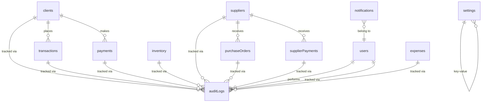

# Shop Ledger PH - Database Schema

## Overview

Shop Ledger PH uses **better-sqlite3** as its primary storage backend, with IndexedDB as a web fallback. All stores follow a JSON blob pattern where each record is stored as a JSON string in a `TEXT` column.

## Storage Architecture

### SQLite Table Structure

All 13 stores are represented as SQLite tables with identical structure:

```sql
CREATE TABLE s_<storeName> (
  id    INTEGER PRIMARY KEY AUTOINCREMENT,
  value TEXT NOT NULL  -- JSON blob
);
```

The `id` column is auto-incremented by SQLite and injected into the JSON blob to mirror IndexedDB's `keyPath: 'id', autoIncrement: true` behavior.

### Store List

| # | Store | Description |
|---|-------|-------------|
| 1 | `clients` | Customer records (utang list) |
| 2 | `transactions` | Sales transactions / invoices |
| 3 | `payments` | Client payment records |
| 4 | `inventory` | Product catalog & stock |
| 5 | `quickItems` | Quick-sale item shortcuts |
| 6 | `settings` | Key-value app settings |
| 7 | `auditLogs` | Audit trail entries |
| 8 | `users` | User accounts |
| 9 | `expenses` | Expense tracking |
| 10 | `suppliers` | Supplier records |
| 11 | `purchaseOrders` | Purchase orders to suppliers |
| 12 | `supplierPayments` | Payments made to suppliers |
| 13 | `notifications` | In-app notifications |

---

## Entity Relationship Diagram



**Relationship Summary:**
- `transactions.clientId` → `clients.id` (which client placed the order)
- `payments.clientId` → `clients.id` (which client made the payment)
- `purchaseOrders.supplierId` → `suppliers.id` (which supplier receives the PO)
- `supplierPayments.supplierId` → `suppliers.id` (which supplier receives payment)
- `auditLogs` records changes to all entities (linked via details/context)
- `notifications` can be user-specific via user reference

---

## Store Schemas

### 1. clients

```json
{
  "id": "INTEGER (auto-generated)",
  "name": "TEXT",
  "contact": "TEXT",
  "phone": "TEXT",
  "address": "TEXT",
  "balance": "REAL (default: 0)",
  "loyaltyPoints": "REAL (default: 0)",
  "totalSpent": "REAL (default: 0)",
  "createdAt": "TEXT (ISO datetime)"
}
```

**Notes:**
- `balance` tracks the client's outstanding utang (negative = owed to store)
- `totalSpent` is cumulative for loyalty tier calculations
- Indexed on: `name` (`idx_clients_name`)

---

### 2. transactions

```json
{
  "id": "INTEGER (auto-generated)",
  "invoiceNo": "TEXT (e.g., INV-00001)",
  "clientId": "INTEGER (→ clients.id, nullable for cash)",
  "clientName": "TEXT",
  "date": "TEXT (ISO datetime)",
  "createdAt": "TEXT (ISO datetime)",
  "items": [
    {
      "name": "TEXT",
      "description": "TEXT",
      "qty": "INTEGER",
      "unitCost": "REAL",
      "lineTotal": "REAL"
    }
  ],
  "subtotal": "REAL",
  "totalInterest": "REAL",
  "discount": "REAL",
  "scDiscount": "REAL (senior citizen discount)",
  "grandTotal": "REAL",
  "paymentMethod": "TEXT (Cash|GCash|Maya|Other)",
  "status": "TEXT (paid|partial|return|voided)",
  "balanceAdded": "REAL",
  "commissionRate": "REAL",
  "commissionAmount": "REAL"
}
```

**Notes:**
- `items` is a JSON array stored inline
- `status` values: `paid` (fully paid), `partial` (utang), `return` (refunded), `voided`
- `balanceAdded` is the amount added to client's utang balance
- Indexed on: `date`, `clientId`, `status`, `invoiceNo`

---

### 3. payments

```json
{
  "id": "INTEGER (auto-generated)",
  "clientId": "INTEGER (→ clients.id)",
  "amount": "REAL",
  "type": "TEXT (Full|Partial)",
  "date": "TEXT (ISO datetime)",
  "notes": "TEXT",
  "createdAt": "TEXT (ISO datetime)",
  "paymentMethod": "TEXT (Cash|GCash|Maya|Other)",
  "referenceNo": "TEXT (optional transaction reference)"
}
```

**Notes:**
- `type` indicates if payment fully or partially settles the utang
- Indexed on: `date`, `clientId`

---

### 4. inventory

```json
{
  "id": "INTEGER (auto-generated)",
  "name": "TEXT",
  "description": "TEXT",
  "sku": "TEXT (Stock Keeping Unit)",
  "barcode": "TEXT",
  "category": "TEXT",
  "stock": "REAL (current quantity)",
  "minStock": "REAL (reorder threshold)",
  "lowStock": "REAL",
  "costPrice": "REAL",
  "sellPrice": "REAL",
  "price": "REAL (legacy, may alias sellPrice)",
  "image": "TEXT (base64 or URL)",
  "variants": [
    {
      "name": "TEXT",
      "sku": "TEXT",
      "price": "REAL",
      "stock": "REAL"
    }
  ],
  "createdAt": "TEXT (ISO datetime)"
}
```

**Notes:**
- `variants` is a JSON array for product variations (size, flavor, etc.)
- Indexed on: `name`, `sku`, `barcode`, `category`

---

### 5. quickItems

```json
{
  "id": "INTEGER (auto-generated)",
  "name": "TEXT",
  "price": "REAL",
  "category": "TEXT",
  "createdAt": "TEXT (ISO datetime)"
}
```

**Notes:**
- Used for one-tap quick sale buttons on the dashboard
- Minimal fields for fast entry

---

### 6. settings

```json
{
  "id": "INTEGER (auto-generated)",
  "key": "TEXT (setting name, unique)",
  "value": "TEXT (JSON string or plain value)"
}
```

**Notes:**
- Key-value store for app configuration
- Common keys: `shopName`, `ownerName`, `cloudBackupPassword`, `smtpConfig`, etc.
- No audit fields (not typically versioned)

---

### 7. auditLogs

```json
{
  "id": "INTEGER (auto-generated)",
  "action": "TEXT (e.g., CREATE, UPDATE, DELETE, LOGIN)",
  "details": "TEXT (JSON or human-readable description)",
  "createdAt": "TEXT (ISO datetime)"
}
```

**Notes:**
- Immutable log - records only inserted, never updated
- Indexed on: `createdAt` (`idx_auditlogs_date`), `action` (`idx_auditlogs_action`)

---

### 8. users

```json
{
  "id": "INTEGER (auto-generated)",
  "username": "TEXT",
  "password": "TEXT (hashed)",
  "role": "TEXT (admin|staff|viewer)",
  "createdAt": "TEXT (ISO datetime)"
}
```

**Notes:**
- Passwords are PBKDF2-hashed (salted) as of v3.9.3
- Legacy SHA-256 and plaintext formats supported for migration

---

### 9. expenses

```json
{
  "id": "INTEGER (auto-generated)",
  "date": "TEXT (ISO datetime)",
  "category": "TEXT (e.g., Supplies, Rent, Utilities)",
  "description": "TEXT",
  "amount": "REAL",
  "payee": "TEXT",
  "type": "TEXT (e.g., recurring, one-time)",
  "createdAt": "TEXT (ISO datetime)"
}
```

**Notes:**
- Indexed on: `date`, `category`

---

### 10. suppliers

```json
{
  "id": "INTEGER (auto-generated)",
  "name": "TEXT",
  "contact": "TEXT",
  "email": "TEXT",
  "category": "TEXT (e.g., Groceries, Beverages)",
  "address": "TEXT",
  "loyaltyPoints": "REAL (default: 0)",
  "totalSpent": "REAL (default: 0)",
  "createdAt": "TEXT (ISO datetime)"
}
```

**Notes:**
- Mirrors client structure for supplier relationship management

---

### 11. purchaseOrders

```json
{
  "id": "INTEGER (auto-generated)",
  "poNo": "TEXT (e.g., PO-00001)",
  "supplierId": "INTEGER (→ suppliers.id)",
  "supplierName": "TEXT",
  "date": "TEXT (ISO datetime)",
  "items": [
    {
      "name": "TEXT",
      "description": "TEXT",
      "qty": "INTEGER",
      "unitCost": "REAL",
      "lineTotal": "REAL"
    }
  ],
  "total": "REAL",
  "status": "TEXT (pending|received|cancelled)",
  "createdAt": "TEXT (ISO datetime)"
}
```

**Notes:**
- `status` tracks PO lifecycle: pending → received, or cancelled
- `items` is a JSON array of ordered products

---

### 12. supplierPayments

```json
{
  "id": "INTEGER (auto-generated)",
  "supplierId": "INTEGER (→ suppliers.id)",
  "amount": "REAL",
  "date": "TEXT (ISO datetime)",
  "paymentMethod": "TEXT (Cash|GCash|Maya|Other)",
  "referenceNo": "TEXT (optional)",
  "createdAt": "TEXT (ISO datetime)"
}
```

**Notes:**
- Records payments made to suppliers for POs

---

### 13. notifications

```json
{
  "id": "INTEGER (auto-generated)",
  "type": "TEXT (e.g., low_stock, payment_received, reminder)",
  "message": "TEXT",
  "read": "BOOLEAN (default: false)",
  "createdAt": "TEXT (ISO datetime)"
}
```

**Notes:**
- In-app notification center for alerts and reminders
- `read` flag for marking notifications as viewed

---

## JSON Extraction Indexes (Migration v2)

To enable efficient querying of JSON fields stored in the `value` column, the following SQLite indexes using `json_extract()` are created:

### Transaction Indexes
```sql
idx_transactions_date    -- s_transactions(json_extract(value, '$.date'))
idx_transactions_client  -- s_transactions(json_extract(value, '$.clientId'))
idx_transactions_status  -- s_transactions(json_extract(value, '$.status'))
idx_transactions_invoice -- s_transactions(json_extract(value, '$.invoiceNo'))
```

### Payment Indexes
```sql
idx_payments_date   -- s_payments(json_extract(value, '$.date'))
idx_payments_client -- s_payments(json_extract(value, '$.clientId'))
```

### Expense Indexes
```sql
idx_expenses_date     -- s_expenses(json_extract(value, '$.date'))
idx_expenses_category -- s_expenses(json_extract(value, '$.category'))
```

### Inventory Indexes
```sql
idx_inventory_name     -- s_inventory(json_extract(value, '$.name'))
idx_inventory_sku      -- s_inventory(json_extract(value, '$.sku'))
idx_inventory_barcode  -- s_inventory(json_extract(value, '$.barcode'))
idx_inventory_category -- s_inventory(json_extract(value, '$.category'))
```

### Client Indexes
```sql
idx_clients_name -- s_clients(json_extract(value, '$.name'))
```

### Audit Log Indexes
```sql
idx_auditlogs_date   -- s_auditLogs(json_extract(value, '$.createdAt'))
idx_auditlogs_action -- s_auditLogs(json_extract(value, '$.action'))
```

---

## Audit Trail Fields

The following fields serve as audit timestamps across stores:

| Store | Audit Fields |
|-------|--------------|
| clients | `createdAt` |
| transactions | `createdAt`, `date` |
| payments | `createdAt`, `date` |
| inventory | `createdAt` |
| quickItems | `createdAt` |
| users | `createdAt` |
| expenses | `createdAt`, `date` |
| suppliers | `createdAt` |
| purchaseOrders | `createdAt`, `date` |
| supplierPayments | `createdAt`, `date` |
| notifications | `createdAt` |
| auditLogs | `createdAt` (immutable log) |

**Note:** `settings` does not have audit fields as it's a configuration store.

---

## Schema Versioning

The schema version is tracked in the `schema_migrations` table:

```sql
CREATE TABLE schema_migrations (
  version INTEGER PRIMARY KEY,
  name TEXT,
  applied_at TEXT
);
```

Current version: **2** (as of v3.10.x)

### Migration History

| Version | Name | Description |
|---------|------|-------------|
| 1 | baseline | Initial 13-store schema |
| 2 | add indexes | JSON extraction indexes for query performance |

---

## Backup Format

The app exports backups as JSON with this structure:

```json
{
  "clients": [...],
  "transactions": [...],
  "payments": [...],
  "inventory": [...],
  "quickItems": [...],
  "settings": [...],
  "auditLogs": [...],
  "users": [...],
  "expenses": [...],
  "suppliers": [...],
  "purchaseOrders": [...],
  "supplierPayments": [...],
  "notifications": [...],
  "version": "3.10.8",
  "exportedAt": "2024-01-15T10:30:00.000Z"
}
```

Each array contains the full JSON records as stored in the database (with `id` field included).
